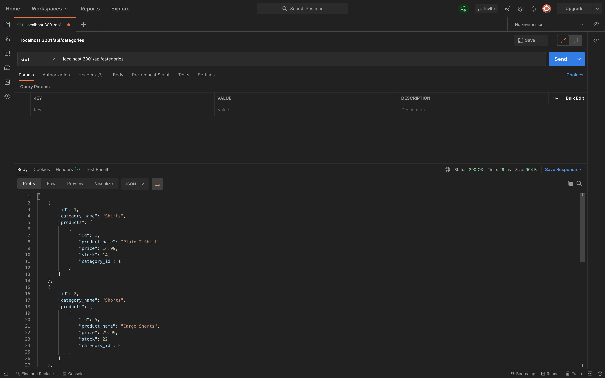

# TABLE OF CONTENTS

- [TABLE OF CONTENTS](#table-of-contents)
  - [E-SHOPPE](#e-shoppe)
  - [LINKS](#links)
  - [INSTALLATION](#installation)
  - [USAGE](#usage)
  - [CONTRIBUTION](#contribution)
  - [LICENSE](#license)
  - [SCREENSHOT](#screenshot)

---

## E-SHOPPE

To create a back-end server for an e-commerce website. Have the ability to view products, tags and categories. As a backend server, you are able to add, view and delete said products, tags and categories. 

## LINKS

- [GitHub Link](https://github.com/sksmejn/e-shoppe)
- [Youtube Walkthrough](youtube.com)

## INSTALLATION

Simply do an ***npm install*** using node.
```terminal
> npm install
```

## USAGE

Simply do an ___npm start___ once you have everything seeded using ___npm run seed___.
```terminal
> npm install
> npm run seed
> npm start
```

## CONTRIBUTION

Feel free to add whatever you like and it will be loaded once reviewed!

## LICENSE
[ISC Licnese](https://opensource.org/licenses/ISC)

## SCREENSHOT



